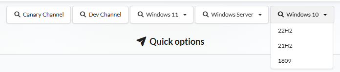
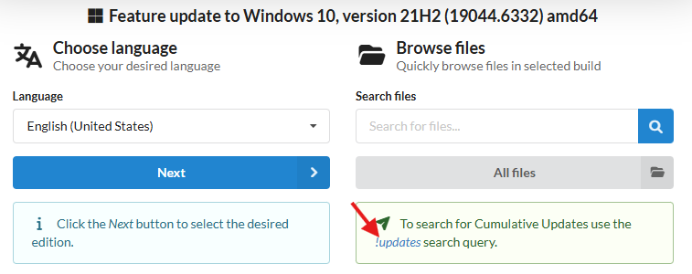
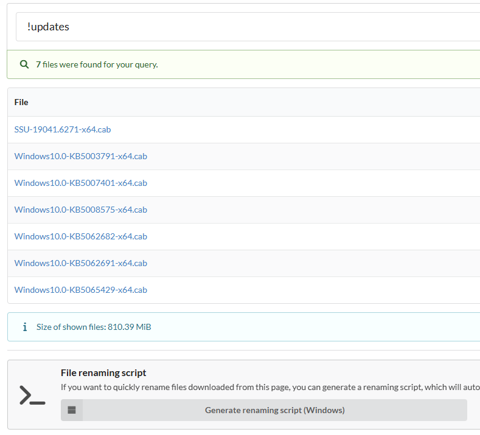

# Update Windows ISO

Official Windows 10 / 11 ISOs available through public free links on [Microsoft](https://www.microsoft.com/en-us/software-download/) or [MSDL](https://msdl.gravesoft.dev/) do not include the latest monthly updates.  
Microsoft usually releases updated ISOs after major feature updates, and the next one typically comes with the following year’s release.

These official ISOs work fine for most users since Windows automatically installs cumulative updates (which include all prior updates).  
However, there are several cases where you may need an updated ISO.

---

## Why You Might Need an Updated ISO

### 1. Windows 10 WinRE Update Issue

- Microsoft provides official public links for Windows 10 22H2 (Build 19045.2965).  
  This build contains an issue that can cause Windows Update to fail when installing [KB5028997](https://support.microsoft.com/topic/kb5028997-instructions-to-manually-resize-your-partition-to-install-the-winre-update-400faa27-9343-461c-ada9-24c8229763bf) on MBR/BIOS installations.
- Using an updated ISO that includes the latest updates resolves this issue.

### 2. Windows 11 LTSC 2024 In-Place Upgrade Issue

- The official Windows 11 LTSC 2024 ISOs were released with build **26100.1742**, and Microsoft does **not** provide newer ISOs to MVS paid subscribers.
- If your Windows 11 LTSC 2024 installation is already updated to a newer build and you attempt an in-place repair upgrade using the 26100.1742 ISO, the process will fail.
- Using an ISO that includes the latest updates will resolve this issue.

> **Note:**  
> The same issue occurs with Windows 11 24H2 GAC editions (non-LTSC). However, since updated ISOs for 25H2 are already available, you can use those instead.

### 3. Frequent Windows Installations

Technicians or shop owners who install Windows multiple times per day benefit greatly from updated ISOs.  
Using an updated ISO saves both time and bandwidth during setup and post-installation updates.

---

## How to Get an Updated ISO

### Option 1: Updated ISOs from MVS

Microsoft provides monthly updated Windows 10 / 11 ISOs (non-LTSC) to [MVS](https://my.visualstudio.com/Downloads) subscribers.  
Alternatively, you can find download links [here](https://massgrave.dev/genuine-installation-media).

---

### Option 2: Manually Update ISOs

**Applies to:** Windows 10 and Windows 11

:::info

- To create an updated ISO for **Windows 10**, your host operating system must be **Windows 8.1 or newer**.  
- To create an updated ISO for **Windows 11**, your host operating system must be **Windows 10 version 2004 or later**, or **Windows 11**.

:::

Follow these steps to manually create an updated Windows ISO:

1. **Download the base ISO**  
   - Get the official ISO from [MSDL](https://msdl.gravesoft.dev/) or [Microsoft](https://www.microsoft.com/en-us/software-download/).

2. **Download W10UI**  
   - Get [W10UI](https://forums.mydigitallife.net/posts/1216064/).  
     Alternative links: [Link 1](https://kutt.it/W10UI) / [Link 2](https://tiny.cc/W10UI).

3. **Download Updates**
   - Go to [UUP Dump](https://uupdump.net/).
   - From the dropdown menu, choose the correct version (e.g., *Windows 10 21H2* for Windows 10 LTSC 2021).
     
   - Select the latest build **that does not include “Cumulative Update”** in its name. It should say “Feature update” or simply “Windows 10/11”.
   - On the next page, click the !updates button as shown below:
     
   - A list of update files will appear.  
     Right-click on the link > **Open in new tab** > in the new tab, right-click again > **Save link as** to download.  
     Repeat for all files.
     
   - Download the “File renaming script” listed on the same page and run it.  
     It will rename all update files correctly. Verify that all file names are correct and all updates are downloaded.

4. **Mount the ISO**  
   - Right-click the downloaded Windows ISO > **Mount**.

5. **Set Up the Working Directory**  
   - Extract the downloaded W10UI zip file.  
   - Create a folder named `Files` in D drive (e.g., `D:\Files`), avoiding spaces and special characters.  
   - Copy all update files and the extracted `W10UI.cmd` file into this folder.  
     The folder should look like this:  
     

6. **Integrate Updates**
   - Right-click `W10UI.cmd` > **Run as administrator**.
   - Press **1** to select `[1] Target` and enter the mounted ISO drive path (e.g., `H:\`).
   - Press **0** to start the integration process and wait for it to complete.

7. **Finish**
   - Once the process finishes, an updated ISO file will be created in the same folder.  
   - Done!

---

:::tip
If you need help or run into issues, you can [contact us](troubleshoot.md) for assistance.
:::
